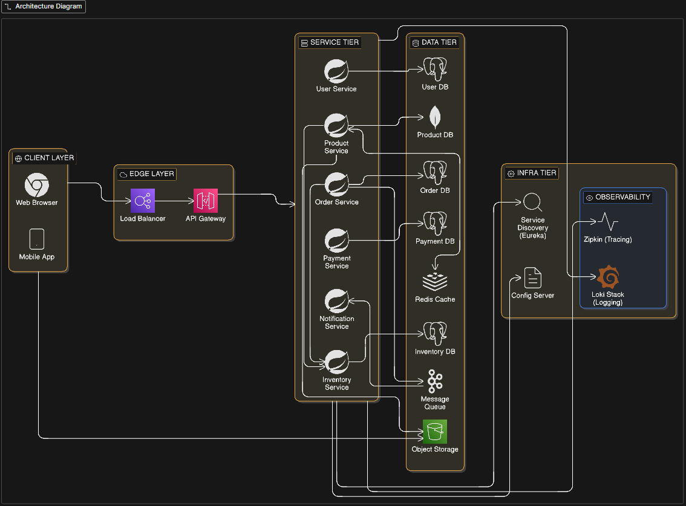

# ☁️ Lumine Cloud - Microservices E-Commerce Platform

**Lumine Cloud** is a robust, event-driven e-commerce backend built with **Spring Boot** and **Spring Cloud**. Designed as a **Minimum Viable Product (MVP)** using **Test-Driven Development (TDD)** methodologies, this project demonstrates a production-grade, distributed architecture containerized with **Docker** and orchestrated using **Kubernetes (K8s)**.


---

## Architecture

The system follows a domain-driven microservices architecture. Services communicate synchronously via REST (for read operations) and asynchronously via Kafka (for write/transactional operations) to ensure high throughput and fault tolerance.

[](https://app.eraser.io/workspace/hP5qlh6SqUOsJlcXHgdV?origin=share)
### Core Services
| Service                  | Tech Stack | Description |
|:-------------------------| :--- | :--- |
| **API Gateway**          | Spring Cloud Gateway | Entry point, routing, and resource server (OAuth2). |
| **User Service**         | Keycloak | IAM, OIDC authentication, and user management. |
| **Product Service**      | MongoDB | Manages product catalog (NoSQL storage). |
| **Order Service**        | PostgreSQL | Handles order placement and transaction logic. |
| **Inventory Service**    | PostgreSQL/MySQL | Tracks stock levels. |
| **Notification Service** | Kafka Consumer | Listens for events and sends emails (simulated). |
| **Discovery Service**    | Netflix Eureka | Service registry and client-side load balancing. |

### Infrastructure & Observability
* **Orchestration:** Kubernetes (Deployments, Services, ConfigMaps, Secrets, Ingress).
* **Messaging:** Apache Kafka (Event-driven communication).
* **Containerization:** Jib (Daemonless container building).
* **Tracing:** Zipkin (Distributed tracing).
* **Metrics:** Prometheus (Scraping) & Grafana (Visualization).
* **Logging:** Loki & Promtail (Centralized log aggregation).

---

## Getting Started

### Prerequisites
* Java 21 (JDK)
* Docker Desktop (with Kubernetes enabled)
* Maven
* Postman (for API testing)

### Installation & Deployment

1.  **Clone the Repository**
    ```bash
    git clone [https://github.com/your-username/lumine-cloud.git](https://github.com/your-username/lumine-cloud.git)
    cd lumine-cloud
    ```

2.  **Build Docker Images**
    We use **Jib** to build optimized images directly to your local Docker daemon.
    ```bash
    # run this in the root folder (or individual service folders)
    mvn compile jib:dockerBuild
    ```

3.  **Deploy to Kubernetes**
    Apply the manifest files from the `k8s/` directory.
    ```bash
    # 1. infrastructure (Databases, Kafka, Keycloak, Observability)
    kubectl apply -f k8s/pvc.yml
    kubectl apply -f k8s/postgres.yml
    kubectl apply -f k8s/mongodb.yml
    kubectl apply -f k8s/kafka.yml
    kubectl apply -f k8s/keycloak.yml
    kubectl apply -f k8s/zipkin.yml
    kubectl apply -f k8s/loki.yml
    kubectl apply -f k8s/promtail.yml
    kubectl apply -f k8s/prometheus.yml
    kubectl apply -f k8s/grafana.yml

    # 2. microservices
    kubectl apply -f k8s/discovery-service.yml
    kubectl apply -f k8s/api-gateway.yml
    kubectl apply -f k8s/product-service.yml
    kubectl apply -f k8s/order-service.yml
    kubectl apply -f k8s/inventory-service.yml
    kubectl apply -f k8s/notification-service.yml
    ```

4.  **Verify Deployment**
    ```bash
    kubectl get pods
    # wait until all pods status is 'Running' (1/1)
    ```

---

## Access Points

| Component | URL | Credentials (Default) |
| :--- | :--- | :--- |
| **API Gateway** | `http://localhost:8080` | (Requires JWT Token) |
| **Keycloak (Auth)** | `http://localhost:8181` | `admin` / `admin` |
| **Eureka Dashboard** | `http://localhost:8761` | N/A |
| **Zipkin (Tracing)** | `http://localhost:9411` | N/A |
| **Grafana (Metrics)** | `http://localhost:3000` | `admin` / `admin` |
| **Prometheus** | `http://localhost:9090` | N/A |

---

## Testing the Flow

1.  **Login:** Get a JWT token from Keycloak (`lumine-realm`).
2.  **Create Product:** POST to `/product-service/api/products`.
3.  **Place Order:** POST to `/order-service/api/orders`.
    * *Synchronous:* Order saved to Postgres.
    * *Asynchronous:* Event sent to Kafka topic `notificationTopic`.
    * *Notification:* Notification Service consumes event and logs receipt.
4.  **Verify:** Check Zipkin for the trace and Grafana for the logs.

---

## Future Improvements (Roadmap)
* [ ] **CI/CD Pipeline** (GitHub Actions).
* [ ] **Redis Caching:** Implement caching for Product Service to improve read performance.
* [ ] **Helm Charts** for simplified deployment.
* [ ] React/Next.js Frontend.
* [ ] Cloud Deployment (AWS EKS / GKE).